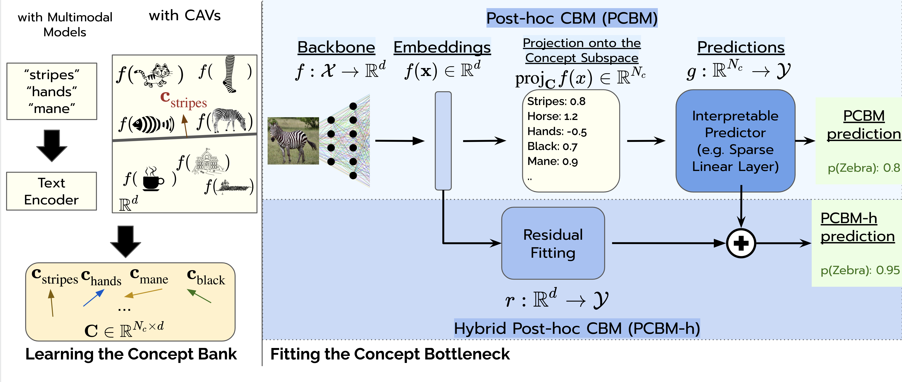

# Post-hoc Concept Bottleneck Models (ICLR 2023 Spotlight)
The code for the paper Post-hoc Concept Bottleneck Models. This paper got an [ICLR2023 Spotlight(notable-top-25%)](https://openreview.net/forum?id=nA5AZ8CEyow)!


This is the joint work of [Mert Yuksekgonul](https://cs.stanford.edu/~merty), [Maggie Wang](https://www.linkedin.com/in/maggie-wang-038b55194/), and [James Zou](https://www.james-zou.com/).

**Update: Reproducibility Study.** A recent study titled "On the Reproducibility of Post-Hoc Concept Bottleneck Models" [recently got accepted to TMLR](https://openreview.net/forum?id=8UfhCZjOV7). It is a very detailed study, and I recommend that you check out their work and [GitHub repository](https://github.com/dgcnz/FACT)! Thank you Nesta, Gregory, Diego, Ioana, and Satchit!!

Here is an overview of our work, and you can find more in our [Preprint](https://arxiv.org/abs/2205.15480) (soon to be updated).




# Data Instructions
Below we list the data sources to download the datasets we used to train / evaluate PCBMs. Once you download a dataset, please go to `data/constants.py` and specify the corresponding paths where you downloaded the datasets. 
## Downloading the Data
| Dataset      | Description | URL |
| ----------- | ----------- |----------- |
| CUB      | Bird Classification dataset       | [Codalab Bundle from CBM repo](https://worksheets.codalab.org/bundles/0xd013a7ba2e88481bbc07e787f73109f5)|
| CUB   | CUB Metadata and splits        |[Codalab Bundle from CBM repo](https://worksheets.codalab.org/bundles/0x5b9d528d2101418b87212db92fea6683) |
| Derm7pt| Dermatology Concepts Dataset |[Get access here](https://derm.cs.sfu.ca/Welcome.html) |
| HAM10k | Skin lesion classification dataset | [Kaggle Link](https://www.kaggle.com/kmader/skin-cancer-mnist-ham10000) |))
|CIFAR10, CIFAR100 | Standard CIFAR datasets | These are automatically downloaded via torchvision. |
|Broden Concept Dataset | This dataset is mostly inherited from the Broden Dataset, thanks to [Amirata Ghorbani](https://www.amiratag.com/) and [Abubakar Abid](https://twitter.com/abidlabs). | [Can be downloaded from this gdrive folder.](https://drive.google.com/file/d/1_yxGcveFcKetoB783H3iv3oiqXHYArT-/view?usp=share_link) |
| SkinCon Concept Dataset | **TODO** will add. We later proposed this dataset for dermatology concepts. | Please see our [NeurIPS22 paper](https://openreview.net/forum?id=gud0qopqJc4) and [the dataset website](https://skincon-dataset.github.io/).|


## Downloading the backbones
Please see `models/model_zoo.py` for the backbones we used. Some models rely on external dependencies (e.g. [pytorchcv](https://pypi.org/project/pytorchcv/) for the CUB backbone, [OpenAI repo](https://github.com/openai/CLIP) for the CLIP backbone.) or will be downloaded (e.g. HAM1000 model from the [DDI repo](https://drive.google.com/drive/folders/1oQ53WH_Tp6rcLZjRp_-UBOQcMl-b1kkP)). If you want to add your own model, please edit `models/model_zoo.py`.

# Learning Concepts
In our paper, we propose two different ways to learn concepts activations vectors to build concepts banks.

## 1- Learning concepts with a concept dataset
To learn concepts in this way, we need to have a concept dataset where each concept should have a set of positive and negative images. We use the CAV methodology (Kim et al. 2018).  <br>

**Concept Dataset Implementations:** We provide the code to extract concept data loaders in `data/concept_loaders.py`. In there, you could find the loaders for `Broden`, `CUB`, and `derm7pt` datasets to extract concept loaders. If you'd like to use custom concept datasets, you could implement your own loader and place there.

**Obtainin concept vectors**: Once you have the concept data loaders, you could use the `learn_concepts_dataset.py` script to learn the concept vectors. As examples, you can run the following scripts (once you obtain the corresponding datasets):
```
OUTPUT_DIR=/path/where/you/save/conceptbanks/
# Learning CUB Concepts
python3 learn_concepts_dataset.py --dataset-name="cub" --backbone-name="resnet18_cub" --C 0.001 0.01 0.1 1.0 10.0 --n-samples=100 --out-dir=$OUTPUT_DIR

# Learning Derm7pt Concepts
python3 learn_concepts_dataset.py --dataset-name="derm7pt" --backbone-name="ham10000_inception" --C 0.001 0.01 0.1 1.0 10.0 --n-samples=50 --out-dir=$OUTPUT_DIR

# Learning Broden Concepts
python3 learn_concepts_dataset.py --dataset-name="broden" --backbone-name="clip:RN50" --C 0.001 0.01 0.1 1.0 10.0 --n-samples=50 --out-dir=$OUTPUT_DIR

```

**Limitation**: 
1. This approach relies on the existence of a concept dataset. These may be hard to get, depending on the application. 
2. Learning concepts with the CAV way could inherit the potential biases in the concept datasets. One should be careful about how the concept dataset is constructed, and what it means to learn that concept. 


## 2- Learning concepts via prompting with multimodal models
What if we do not have a concept dataset? We could leverage multimodal models, such as [CLIP](https://arxiv.org/abs/2103.00020)! i.e. We can simply prompt the text encoder with the concept name, and obtain the concept vector in the shared embedding space. 

We provide the code to do this in `learn_concepts_multimodal.py`. You can run the following script to learn the concept vectors:
```
python3 learn_concepts_multimodal.py --backbone-name="clip:RN50" --classes=cifar10 --out-dir=$OUTPUT_DIR --recurse=1
```

Currently, we support CIFAR10/CIFAR100 for this approach. You can very easily add the set of class names in the script and obtain the concept bank for your own purpose. 

**Limitation**: This approach is limited to the multimodal models that have a shared embedding space. Existing multimodal models that are not specialized may not do very well with domain-specific concepts (e.g. healthcare concepts).

# Training PCBMs
Once you have a concept bank and a backbone, you are ready to train your PCBM! We provide the code to train PCBMs in `train_pcmb.py`. You can run the following script to train a PCBM on CUB:
```
python3 train_pcbm.py --concept-bank="${OUTPUT_DIR}/cub_resnet18_cub_0.1_100.pkl" --dataset="cub" --backbone-name="resnet18_cub" --out-dir=$OUTPUT_DIR --lam=2e-4
```
Please see the `train_pcbm.py` file for the arguments / where the models are saved. 


**Limitation**: There is a tradeoff between the regularization and how sparse/"interpretable" (yes, hard to define what exactly this means) the linear module is. This hyperparameter selection can be a bit tedious. We can play around with the `lam` parameter and `alpha` parameter to observe the concept coefficients and understand what seems like a good tradeoff. Good thing is, we can simply monitor concept weights, and since concepts are more meaningful, we may have a better say here.


## Training PCBM-h
Once you have the PCBM, you can train the PCBM-h model by running the following script:
```
pcbm_path="/path/to/pcbm_cub__resnet18_cub__cub_resnet18_cub_0__lam:0.0002__alpha:0.99__seed:42.ckpt"
python3 train_pcbm_h.py --concept-bank="${OUTPUT_DIR}/cub_resnet18_cub_0.1_100.pkl" --pcbm-path=$pcbm_path --out-dir=$OUTPUT_DIR --dataset="cub"
```

# Notes
This repository is WIP! The quickest way to reach out to me is via `merty@stanford.edu`. 

# Citation
If you find this code useful, please consider citing our paper:
```
@inproceedings{
yuksekgonul2023posthoc,
title={Post-hoc Concept Bottleneck Models},
author={Mert Yuksekgonul and Maggie Wang and James Zou},
booktitle={The Eleventh International Conference on Learning Representations },
year={2023},
url={https://openreview.net/forum?id=nA5AZ8CEyow}
}
```